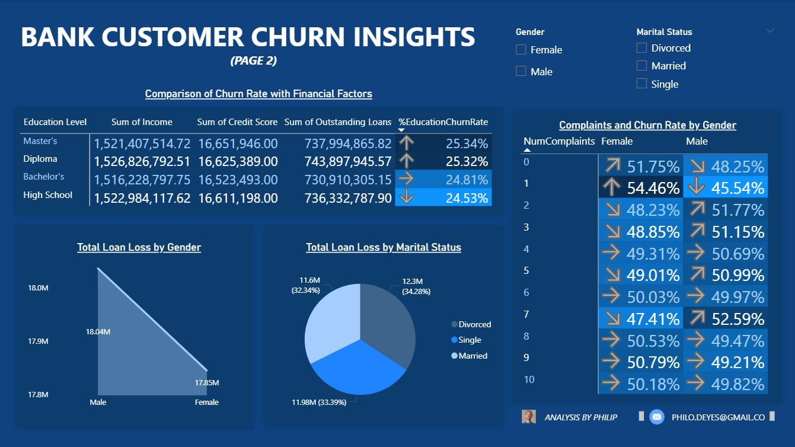

# BANK-CUSTOMER-CHURN-INSIGHTS-2

# Bank Customer Churn Insights

This repository contains a Power BI dashboard that provides visual insights into bank customer churn behavior. The dashboard explores patterns in customer retention and attrition across demographics and financial factors.

---

## 📊 Dashboard Preview

### 🔹 Page 1: Overview and Key Metrics

### 🔹 Page 2: Financial and Demographic Analysis

---

## 🔍 Key Insights

- **Total Customers:** 116K
- **Churned Customers:** 14K (12.19% Churn Rate)
- **Retained Customers:** 102K (87.81% Retention Rate)
- **Total Loan Loss:** $35.88M
- **Top Churn Reasons:**  
  - Service Issues (25.35%)  
  - Account Closure (25.17%)  
  - Relocation (25.03%)  
  - Better Offers Elsewhere (24.44%)

---

## 🧠 Analysis Breakdown

- **Churn by Gender & Marital Status**
- **Customer Retention Rates**
- **Churn by Education Level**
- **Impact of Compl**

---
powerbi, customer-churn, data-analysis, dashboard, business-intelligence, bank-analytics
